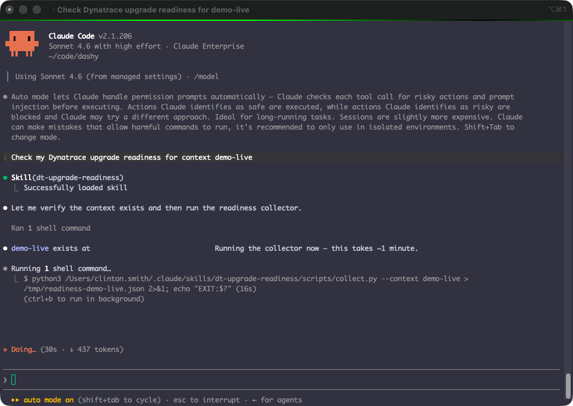

# dt-upgrade-readiness-skill

An agentic **Dynatrace Gen2 (Classic) → Gen3 upgrade-readiness** skill for AI
coding agents. It runs the upgrade-readiness checks **directly against your
tenant with `dtctl`** — querying Grail, settings, and platform APIs — then
diagnoses what still blocks the upgrade, ranks the highest-impact fixes, and can
produce a shareable HTML report with remediation steps grounded in
docs.dynatrace.com.

It's a **portable knowledge package** following the [Agent Skills](https://agentskills.io)
open format — the same convention as [dynatrace/dynatrace-for-ai](https://github.com/Dynatrace/dynatrace-for-ai).
It works with Claude Code, GitHub Copilot, Cursor, Cline, OpenCode, Gemini CLI,
and [30+ other compatible tools](https://agentskills.io).



## Prerequisites

Set these up first, then install the skill (next section).

### 1. dtctl — required

The [dtctl](https://github.com/dynatrace-oss/dtctl) CLI runs the readiness
checks against your tenant. Install it:

```bash
# macOS / Linux (Homebrew)
brew install dynatrace-oss/tap/dtctl
```
```powershell
# Windows (PowerShell) — download the official installer, review it, then run
irm https://raw.githubusercontent.com/dynatrace-oss/dtctl/main/install.ps1 -OutFile dtctl-install.ps1
.\dtctl-install.ps1
```

Other methods (shell-script install, Linux without Homebrew, prebuilt binaries):
[dtctl installation guide](https://github.com/dynatrace-oss/dtctl#installation).
Then authenticate and verify:

```bash
dtctl auth login --context my-env --environment "https://<env>.apps.dynatrace.com"
dtctl doctor
```

> On headless servers, WSL, or containers (no OS keyring), set
> `DTCTL_TOKEN_STORAGE=file` before logging in
> (PowerShell: `$env:DTCTL_TOKEN_STORAGE="file"`).

### 2. Dynatrace AI skills (dynatrace-for-ai) — recommended

Companion knowledge (DQL, platform, migration) this skill pairs with.
Cross-platform, one command:

```bash
npx skills add dynatrace/dynatrace-for-ai
```

Or as a Claude Code plugin:

```bash
claude plugin marketplace add dynatrace/dynatrace-for-ai
claude plugin install dynatrace@dynatrace-for-ai
```

### 3. Python 3 — required

Used by the skill's collector. Bundled on macOS/Linux; on Windows install from
[python.org](https://www.python.org) or the Microsoft Store.

## Install this skill

### Skills Package (skills.sh) — recommended

```bash
npx skills add SudoSmitty/dt-upgrade-readiness-skill
```

One command, every agent. It copies the skill into your agent's skills path
(`.claude/skills/`, `.cursor/skills/`, `.agents/skills/`, …) automatically.

### Manual

Copy the skill directory into your agent's skills path
(`.agents/skills/`, `.claude/skills/`, `.cursor/skills/`, etc.):

```bash
# macOS / Linux
cp -r skills/dt-upgrade-readiness ~/.claude/skills/
```
```powershell
# Windows (PowerShell)
Copy-Item -Recurse skills\dt-upgrade-readiness $HOME\.claude\skills\
```

For GitHub Copilot / VS Code, place it under your workspace's skills path per
[agentskills.io](https://agentskills.io).

## Usage

Open your agent and ask:

> **"Check my Dynatrace upgrade readiness for context `my-env`."**

The skill verifies prerequisites (and guides installing anything missing),
collects the readiness data, returns a prioritized migration plan, and
generates a shareable HTML report with per-issue remediation steps.

## Skills

| Skill | Description |
|-------|-------------|
| [dt-upgrade-readiness](skills/dt-upgrade-readiness/SKILL.md) | Assess a tenant's Gen2→Gen3 upgrade readiness by running the readiness checks directly against the tenant with dtctl; diagnose blockers, rank highest-impact fixes, and generate a remediation report. |

## Notes

- **Read-only.** The skill only reads your tenant; it never changes
  configuration.
- **Nothing to install in the tenant.** All checks run remotely through `dtctl`
  — no app or configuration needs to be added to your environment.
- **Security.** No dependencies, no telemetry, install-time side effects, or
  outbound calls beyond your own `dtctl`. See [SECURITY.md](SECURITY.md).

## License

Apache-2.0.
